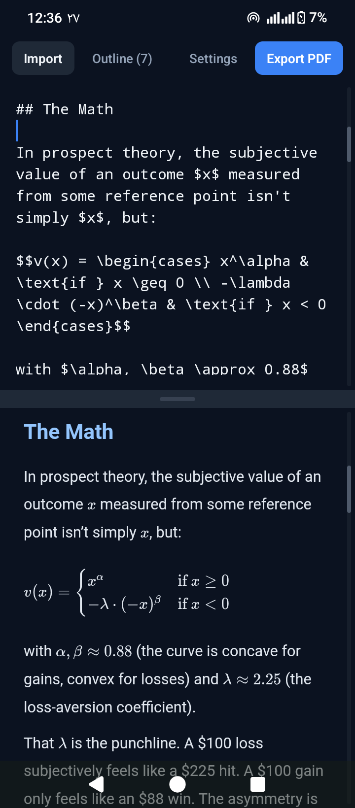

# PaperFlow

A clean, cross-platform mobile **markdown editor** with split-pane live preview, LaTeX math rendering, and one-tap PDF export.

> **Status:** Beta. Actively developing.
>
> **Offline-first.** Every dependency (markdown-it, KaTeX, fonts) is bundled at build time, so the app runs entirely on-device with no network calls. Cloud sync and document sharing are on the roadmap for a later release.

## Try it (Android)

Download the latest APK from [Releases](../../releases). Install and run, no dev setup needed.

You'll need to allow installation from unknown sources on your device the first time. An iOS build is not yet available.

## Features

- **Split-pane or tabbed view**: edit and preview side-by-side, or toggle between them.
- **Live markdown preview**: full markdown rendering via `markdown-it`.
- **LaTeX math support**: inline (`$...$`) and display (`$$...$$`) equations rendered with KaTeX.
- **PDF export**: generate a clean PDF and share it through the system share sheet.
- **Document import**: open `.md` and text files from device storage.
- **Table of contents**: jump between headings in the editor or preview.
- **Editor↔preview scroll-sync**: keeps both panes aligned as you type or scroll.
- **Persian + English**: proper RTL/LTR handling, including for math.
- **Light / Dark / Auto themes**.
- **Persisted documents and settings** via MMKV.

## Tech Stack

- **React Native** + **Expo** (file-based routing via expo-router)
- **TypeScript**
- **Zustand**: state management
- **react-native-mmkv**: persistent local storage
- **react-native-webview**: preview rendering engine
- **markdown-it** + **markdown-it-texmath** + **KaTeX**: markdown and math
- **expo-print** + **expo-sharing**: PDF generation and sharing
- **expo-document-picker** + **expo-file-system**: file import

## Screenshots

<p align="center">
  
</p>

## Sample

A short document showing what PaperFlow can actually produce, written in the app and exported through it.

- [`sample/notes.md`](./sample/notes.md): the source markdown
- [`sample/Notes-on-Loss-Aversion.pdf`](./sample/Notes-on-Loss-Aversion.pdf): generated PDF, with math, tables, code, and Persian/RTL all rendered by the app

## Running Locally

```bash
# Install dependencies
npm install

# Start the dev server
npx expo start
```

From the dev menu you can open the app in an Android emulator, iOS simulator, a physical device via Expo Go (limited; native modules require a dev build), or the web.

To create a development build with full native module support:

```bash
npx expo run:android   # or run:ios
```

## Project Structure

```
paperflow/
├── app/                # expo-router screens
│   ├── _layout.tsx
│   ├── index.tsx       # main editor + preview screen
│   ├── settings.tsx    # appearance and preview settings
│   └── toc.tsx         # table of contents
├── components/         # UI components (Editor, Preview, Toolbar, etc.)
├── lib/                # markdown, storage, store, theme, HTML template
├── hooks/              # custom React hooks
├── constants/          # shared constants
└── assets/             # fonts, images, icons
```

## Author

Hamed Nasrabadi, Statistics student at the University of Tehran.
